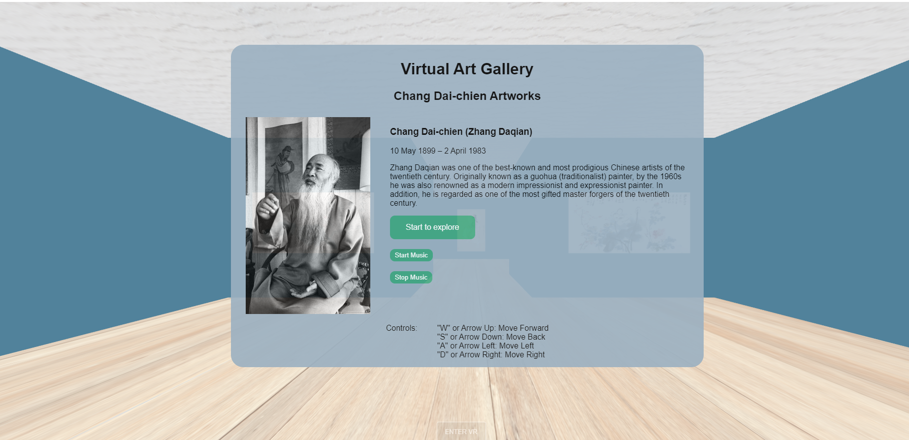

## Introduction
I created a virtual art gallery using three.js, and it's also a multimedia project, I've merged vision and audition in it, which definitely giving you a unforgettable experience.
## Installation
### Environment setup
You need node.js to set up a runtime environment.
You need VSCode as your IDE.
### Clone or download the zip file of the repository
```bash
git clone https://github.com/H1brian/virtual_art_gallery.git
```
### Then install all the dependencies
```bash
npm install
```
### Run the local server with vite
```bash
npx vite
```
### You should see the home page like below

### Here are how to explore and how to control
#### Start and End
Click Green button "Start to explore" to start
Press "ESC" on the keyboard to exit
#### Move around
"W" "S" "A" "D" or 
Arrow Up Down Left Right
to Move Forward Back Left Right
#### Check paiting's information
Move closer to the paiting you want to check, information will appear automatically and disappear when move away.
#### Turn on the music
Click the button "Start the music" to start, "Stop the music" to stop